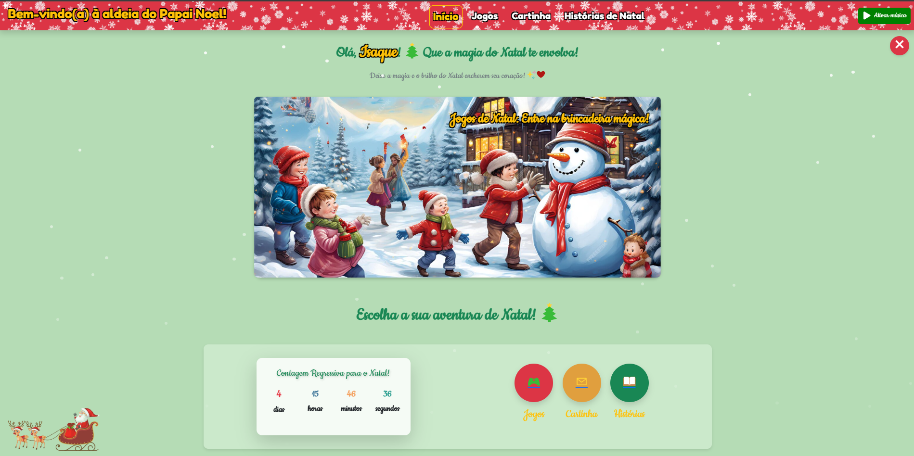
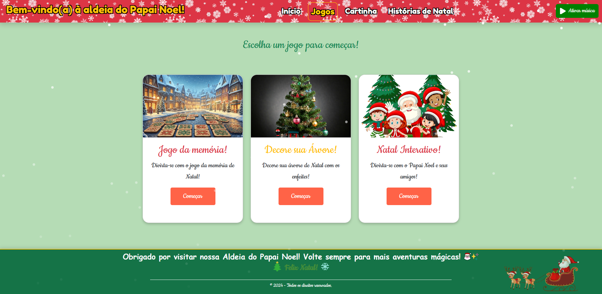
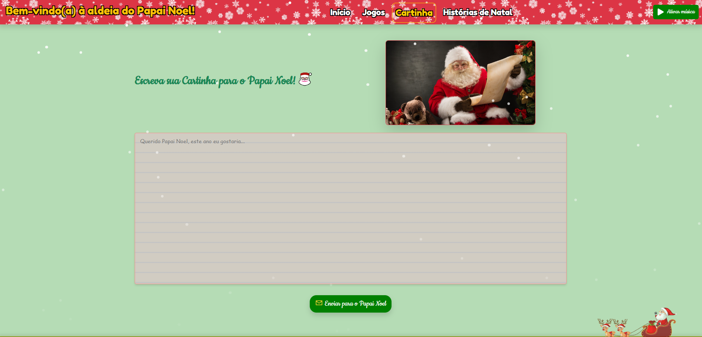
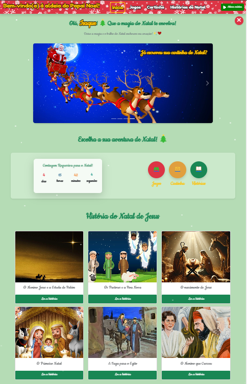

# 🎄 Site Interativo de Natal para Crianças 🎅

**Bem-vindo ao projeto de Natal!**  
Este site temático foi desenvolvido para proporcionar diversão e interatividade às crianças, trazendo o espírito natalino com:
- Jogos educativos e criativos.
- Histórias sobre o Natal de Jesus.
- Ferramentas para personalização e diversão, como a criação de cartinhas para o Papai Noel.

---

## 🌟 Prints do Projeto

### Página Inicial

### Jogos

### Cartinha para o Papai Noel

### Design Responsivo

---

## 🛠️ Funcionalidades do Projeto
- **Tela Inicial Personalizada**: O site saúda a criança com o nome dela.
- **Jogos Interativos**:
  - Decoração de árvore de Natal.
  - Jogo da memória.
  - Quiz divertido com perguntas visuais.
- **Histórias de Natal**: Conheça a história do nascimento de Jesus.
- **Cartinha para o Papai Noel**: Escreva, edite e salve a cartinha em PDF.

---

## ⌨️ Tecnologias Utilizadas
- **React**: Framework principal para o desenvolvimento.
- **Bootstrap**: Para estilização e design responsivo.
- **Styled Components**: Para personalizações de estilo.

---

## 🔗 Acesse o Projeto Online
O site está hospedado no Vercel:  
[🎅 Clique aqui para acessar o projeto](https://thiarafernandes.github.io/natal-kids/)

---

## 📚 Aprendizados
Este projeto foi uma oportunidade incrível para explorar e aplicar conceitos de:
- **Desenvolvimento Responsivo**: Garantindo uma boa experiência em dispositivos móveis.
- **Interatividade com React**: Implementando funcionalidades dinâmicas.
- **Hospedagem no Vercel**: Tornando o projeto acessível online.

---

## 📬 Contato
Se você gostou deste projeto ou quer saber mais, entre em contato comigo:  

